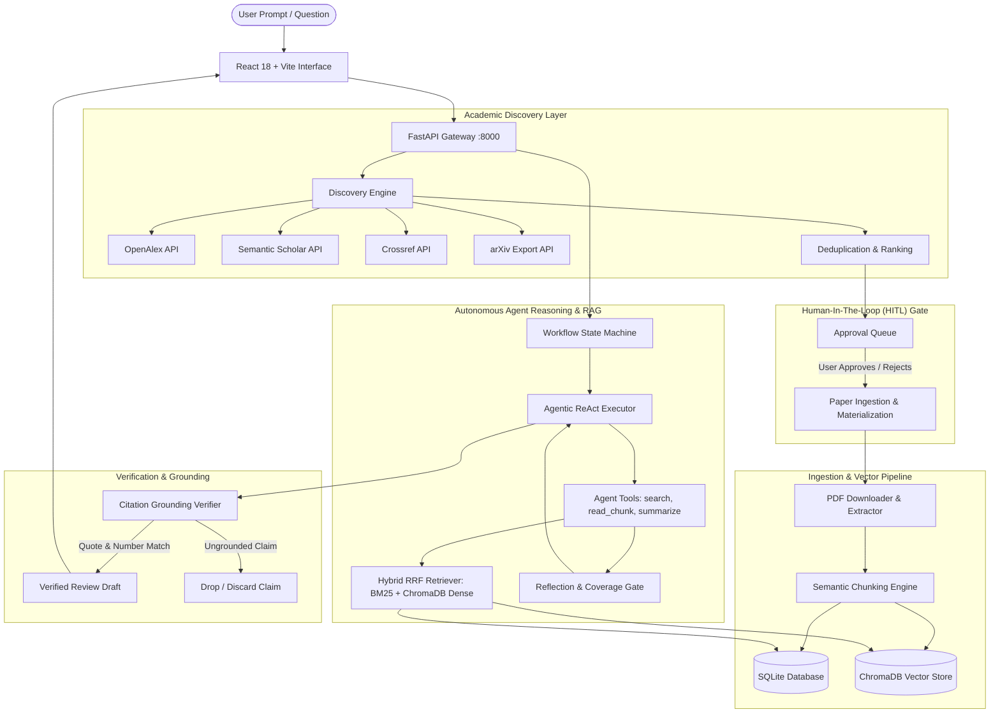
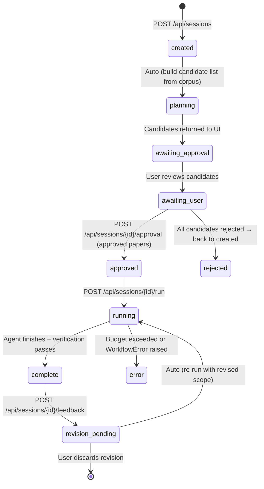

# R-Lens: Autonomous Agentic AI Academic Research Assistant

> **Production-grade academic intelligence**: Multi-source literature discovery, human-in-the-loop candidate curation, hybrid vector RAG, autonomous agentic reasoning, verifiable citation grounding, and interactive PDF exploration — presented through a modern conversational AI interface.

[](#testing--quality-assurance)
[](#prerequisites)
[](#backend-architecture)
[](#frontend-architecture)
[](#vector-database--hybrid-retrieval)
[](#llm--embedding-providers)
[](#license)

---

## Table of Contents

1. [Executive Overview](#executive-overview)
2. [Interface & Design Philosophy](#interface--design-philosophy)
3. [End-to-End System Architecture](#end-to-end-system-architecture)
4. [How It Works: Step-by-Step Lifecycle](#how-it-works-step-by-step-lifecycle)
5. [Core Features & Modules](#core-features--modules)
6. [Multi-Source Academic Discovery Engine](#multi-source-academic-discovery-engine)
7. [Vector Database & Hybrid Retrieval (RAG)](#vector-database--hybrid-retrieval-rag)
8. [Citation Grounding & Verification Engine](#citation-grounding--verification-engine)
9. [Autonomous Agent Execution & ReAct Loop](#autonomous-agent-execution--react-loop)
10. [Complete Installation & Setup Guide](#complete-installation--setup-guide)
11. [Configuration Reference (.env)](#configuration-reference-env)
12. [API Reference & Router Endpoints](#api-reference--router-endpoints)
13. [Testing & Quality Assurance](#testing--quality-assurance)
14. [Evaluation Matrix & Benchmark Harness](#evaluation-matrix--benchmark-harness)
15. [Directory Tree & Codebase Map](#directory-tree--codebase-map)
16. [Honesty & Integrity Policy](#honesty--integrity-policy)
17. [License & Citation](#license--citation)

---

## Executive Overview

**R-Lens** is an open-source, production-ready agentic AI system engineered specifically for academic literature review, evidence synthesis, and interactive research paper exploration.

Traditional AI search engines often hallucinate citations, invent paper titles, or generate generic summaries without traceable evidentiary lineage. R-Lens solves this fundamentally by coupling **live multi-source academic queries** (OpenAlex, Semantic Scholar, Crossref, and arXiv) with **deterministic text extraction**, **hybrid dense/sparse retrieval (ChromaDB + BM25)**, **strict quotation verification**, and **human-in-the-loop (HITL) gatekeeping**.

The user interacts through a conversational interface inspired by **ChatGPT and Gemini**, enhanced with the source-grounded precision of **Perplexity** and the academic depth of **SciSpace**.

---

## Interface & Design Philosophy

The interface centers the user experience on natural academic conversation rather than a rigid dashboard:

```
Ask Research Topic / Question
             ↓
Autonomous Agentic Discovery (OpenAlex, arXiv, S2, Crossref)
             ↓
Conversational Stream with Live Milestone Card
             ↓
Grounded Academic Paper Results & Inline Action Cards
             ↓
Follow-Up Queries, In-Depth Evidence Synthesis & PDF Deep-Dive
```

### Key UI/UX Characteristics:
- **Tri-Pane Desktop Layout**: Fixed left navigation sidebar (260px), centered max-width conversation canvas (`max-w-4xl`), and an expandable/collapsible contextual inspector panel (*Sources*, *Evidence*, *PDF reader*).
- **ChatGPT/Gemini-Style Composer**: Sticky bottom composer with multiline auto-growth, `Enter` to submit, `Shift + Enter` for new lines, focus states, and intent classification pills.
- **Milestone Activity Card**: Filters out raw internal reasoning or chain-of-thought technical noise (`Thought:`, `Action:`, `Observation:`, `tool_Exception:`) to surface clean, verifiable progress indicators (`✓ Generated search queries`, `✓ Searched academic literature`, `● Analyzing evidence`).
- **Curated Palette**: Clean light neutral canvas (`#FAFAFC` / `#FFFFFF`), high-contrast charcoal typography (`#111827`), subtle borders (`#E5E7EB`), and refined purple accent tokens (`#6D28D9` / `#7C3AED`).

---

## End-to-End System Architecture



---

## How It Works: Step-by-Step Lifecycle

### Phase 1: Topic Submission & Intent Analysis
1. The user inputs a research topic, query, or hypothesis into the sticky chat composer (e.g., *"How can explainable deep learning and metaheuristic optimization improve multi-horizon data center power forecasting?"*).
2. The frontend triggers the discovery pipeline (`POST /api/discover/search` or `POST /api/sessions`).

### Phase 2: Multi-Source Search & Deduplication
1. The backend dispatches parallel queries across **OpenAlex**, **Semantic Scholar**, **Crossref**, and **arXiv**.
2. Queries are automatically refined and expanded with academic synonyms and domain terms.
3. Raw candidates are normalized and deduplicated across sources using DOI matching, normalized title distance, and publication year matching.
4. Abstract inverted indexes (from OpenAlex) are automatically reconstructed into readable text.

### Phase 3: Human-in-the-Loop (HITL) Source Approval
1. The system displays candidate papers inside the conversation.
2. The user has complete agency to **Approve** or **Reject** candidates (`POST /api/sessions/{id}/approval`).
3. Only approved papers proceed to full materialization, preventing irrelevant noise from contaminating the retrieval index.

### Phase 4: Ingestion, Chunking & Vector Indexing
1. Open-access PDFs are retrieved via direct publisher or repository URLs.
2. `pypdf` and `pdfplumber` extract text while tracking **exact page numbers and section headers**.
3. Text is partitioned into semantic chunks with sliding overlaps.
4. Embeddings are generated using **OpenRouter Nemotron 3 Embed 1B** (or deterministic fake embedders for offline mode) and stored in **ChromaDB**.
5. Chunk metadata, paper records, and session states are persisted to **SQLite**.

### Phase 5: Autonomous ReAct Agent Loop
1. The agent workflow initializes with strict execution budgets (maximum 8 iterations, 12 tool calls, 3 query refinements).
2. The agent executes iterative cycles of:
   - **Formulating search queries** based on missing aspects of the research question.
   - **Retrieving passages** using Reciprocal Rank Fusion (RRF) combining BM25 keyword search with ChromaDB dense vector cosine similarity.
   - **Inspecting specific chunk contexts** (`read_chunk` tool).
   - **Evaluating coverage** via an internal reflection loop against the user's research goals.

### Phase 6: Citation Grounding & Hallucination Elimination
1. Every claim generated by the agent must link directly to an explicit source marker (`[S1]`, `[S2]`, etc.).
2. The verification engine executes strict quotation containment checks:
   - It matches extracted quotes against the raw chunk text in the database.
   - It verifies numerical containment (statistics, MSE, MAE, percentages).
3. Any ungrounded claim that fails verification is **automatically dropped** from the final synthesis.

### Phase 7: Synthesis & Verifiable Presentation
1. The validated output is assembled into a structured response containing:
   - Direct synthesized answer
   - Key methodology findings
   - Comparative metric tables
   - Research gaps and limitations
   - Grounded citations linking directly to arXiv/DOI, page numbers, and exact passages.

### Phase 8: Conversational Follow-Up & Feedback Revision
1. The user can ask follow-up questions directly in the chat session.
2. The user can submit targeted feedback (`POST /api/sessions/{id}/feedback`), such as *"Exclude paper X"* or *"Focus on transformer models"*.
3. The state machine archives prior drafts, adjusts the approved paper scope, and triggers targeted re-retrieval to produce an updated revision.

---

## Core Features & Modules

### 1. Conversational Research Workspace (`/research`)
- Natural conversational session that evolves as questions are posed.
- Live candidate paper cards with direct actions: `[Open Paper]`, `[Save & Index]`, and `[Chat with Paper]`.
- Dynamic, collapsible three-tab Context Panel:
  - **Sources**: Real metadata of all retrieved papers.
  - **Evidence**: Extracted empirical claims, methodology details, and statistical findings.
  - **PDF Reader**: Embedded document viewer for instant verification.

### 2. Chat with PDF / Paper Chat (`/chat-with-pdf`, `/paper-chat/:docId`)
- Deep conversational interaction with any uploaded or discovered academic document.
- Answers feature clickable citation badges (`[p. 4]`, `[p. 11]`) that automatically highlight the exact passage in the split-view PDF reader.
- Works offline via extractive retrieval or hosted via OpenRouter LLMs.

### 3. Automated Literature Review (`/report`, `/literature-review`)
- End-to-end synthesis engine producing publication-ready literature reviews.
- Structured sections: Background, Methodological Paradigms, Empirical Results, Conflicting Evidence, Open Research Gaps, and IEEE/APA formatted bibliography.
- Full revision history tracking with visual diff comparisons between drafts.

### 4. Benchmark Evidence Matrix (`/evidence`)
- Structured tabular comparison of experimental metrics across papers (e.g., MSE, MAE, RMSE, parameter counts, inference latency).
- Exportable to CSV and BibTeX directly derived from real ingested corpus data.

### 5. Cross-Paradigm Comparison (`/compare`)
- Side-by-side architectural evaluations (e.g., Transformers vs. Linear Decomposition vs. Diffusion vs. Graph Neural Networks).
- Synthesizes trade-offs in computational complexity, horizon stability, and empirical benchmarks.

### 6. AI Research Utility Suite
- **AI Writer (`/writer`)**: Academic drafting assistant with adjustable formality, citation styling, and section-by-section drafting.
- **Academic Paraphraser (`/paraphrase`)**: Multi-mode text rewriter supporting *Academic*, *Fluent*, *Concise*, and *Creative* styles while preserving technical terminology.
- **Citation Generator (`/citations`)**: Generates verifiable citations in **APA 7**, **MLA 9**, **IEEE**, **Chicago**, and **Vancouver** formats with one-click clipboard copying.
- **AI Detector (`/detector`)**: Multi-metric originality evaluation displaying perplexity, burstiness, repetitive n-gram distribution, and sentence-level probability highlights.
- **Agent Gallery (`/gallery`)**: Catalog of specialized autonomous research agents configured for specific sub-tasks.
- **Topic Explorer (`/topics`)**: Curated taxonomy of trending research areas with real-time academic paper volume indicators.
- **Data Extractor (`/extract`)**: Dedicated parsing tool for pulling raw data tables, figures, equations, and statistics out of PDF files.

---

## Multi-Source Academic Discovery Engine

The discovery engine (`backend/services/academic_search.py` & `backend/services/discovery.py`) interfaces with four academic indexing APIs without relying on fabricated mock data:

| Provider | Coverage | Features Utilized |
| :--- | :--- | :--- |
| **OpenAlex** | ~250M+ scientific works | Open catalog, inverted abstract reconstruction, open-access PDF links, concepts |
| **Semantic Scholar** | ~200M+ academic papers | Citation graph, influential citations, TLDR summaries, open-access status |
| **Crossref** | ~140M+ DOI records | Publisher metadata, authoritative publication years, registered DOIs |
| **arXiv** | ~2.5M+ preprints | CS, AI, Math, and Physics preprints via the official arXiv export API |

### Deduplication Logic:
```python
# Normalized identifier matching:
# 1. Exact DOI match
# 2. Normalized title (lowercase, alphanumeric only) + publication year matching
# 3. Fuzzy title match (Levenshtein distance threshold >= 0.92)
```

---

## Vector Database & Hybrid Retrieval (RAG)

R-Lens implements a **hybrid retrieval** architecture that combines dense semantic search with lexical keyword matching:

### ChromaDB Architecture:
- Embedded vector database powered by `chromadb.PersistentClient`.
- Partitioned into strictly isolated collections:
  - `rlens_passages_real`: Documents embedded via real OpenRouter embedding models.
  - `rlens_passages_fake`: Documents embedded via deterministic fake embeddings for offline and testing environments.
- Per-chunk metadata fields: `doc_id`, `chunk_id`, `page`, `section`, `title`, `authors`, `year`, `venue`, `arxiv_id`, `doi`, `source_url`, `full_text_available`.

### Reciprocal Rank Fusion (RRF):
Retrieval merges dense vector cosine similarity with BM25 sparse keyword ranking:
$$\text{RRF Score}(d) = \sum_{m \in \{\text{dense}, \text{sparse}\}} \frac{1}{k + \text{rank}_m(d)}$$
Where $k = 60$ ensures balanced weighting between high-ranking keyword hits and semantic contextual matches.

---

## Citation Grounding & Verification Engine

To eliminate LLM hallucinations, every claim is subjected to deterministic verification:

```
Agent Generates Claim with Marker [S#]
                 ↓
Lookup Source Chunk in SQLite / ChromaDB
                 ↓
1. Verbatim Substring Containment Check
2. Numerical & Metric Containment Check
                 ↓
Passed? ──► YES ──► Keep Claim with Clickable Grounded Citation
        └──► NO  ──► DROP Claim from Final Response
```

If an LLM hallucinates an empirical statistic (e.g., claiming a model achieved an MSE of 0.210 when the source paper reported 0.386), the verification engine catches the numerical discrepancy and drops the claim automatically.

---

## Autonomous Agent Execution & ReAct Loop

The agent executor (`backend/services/agent/executor.py`) operates under strict operational budgets to ensure responsiveness and prevent runaway loops:

- **Iteration Budget**: Maximum 8 cognitive reasoning cycles per query.
- **Tool Call Budget**: Maximum 12 tool invocations per session.
- **Refinement Budget**: Maximum 3 query reformulation attempts.
- **Available Tools**:
  - `search_literature(query, limit)`: Hybrid search over approved papers.
  - `read_chunk(doc_id, chunk_id)`: Fetches complete text surrounding a chunk.
  - `get_paper_metadata(doc_id)`: Fetches publication and author details.
  - `summarize_evidence(doc_id, focus)`: Targeted summarization of a paper's findings.

---

## Complete Installation & Setup Guide

### Prerequisites

| Requirement | Supported Versions | Notes |
| :--- | :--- | :--- |
| **Python** | 3.10, 3.11, 3.12 | Required for backend and vector store |
| **Node.js** | 18.x, 20.x, 22.x | Required for frontend build and Vite dev server |
| **npm** | 9.x or higher | Bundled with Node.js |
| **Git** | Any modern version | Required for cloning the repository |

---

### Step 1: Clone the Repository

```bash
git clone https://github.com/GIRIDHAR-U-47/Agentic-AI.git
cd Agentic-AI
```

---

### Step 2: Configure Environment Variables

Navigate to the `backend/` directory and create your `.env` configuration:

```bash
cd backend
copy .env.example .env          # Windows Command Prompt
# cp .env.example .env          # macOS / Linux / PowerShell
```

Edit `backend/.env` with your preferred settings:

```env
# Optional: Unlock OpenRouter LLM reasoning and embedding models
OPENROUTER_API_KEY=sk-or-v1-xxxxxxxxxxxxxxxxxxxxxxxxxxxxxxxx

# Enable ChromaDB vector store ('chroma' for dense RAG, 'off' for BM25-only)
RLENS_VECTOR_BACKEND=chroma

# LLM provider: 'offline', 'openrouter', or 'openrouter-strong'
RLENS_LLM_PROVIDER=offline

# ChromaDB persistence directory
RLENS_CHROMA_DIR=data/chroma/

# Embedding model configuration
OPENROUTER_EMBEDDING_MODEL=nvidia/nemotron-3-embed-1b:free
OPENROUTER_EMBEDDING_DIM=2048
```

> **Note on Offline Mode**: If `OPENROUTER_API_KEY` is not provided, R-Lens automatically operates in **`offline` mode**. In this mode, text extraction, search, chunking, and deterministic verbatim synthesis work with zero external API calls and zero operational cost.

---

### Step 3: Install Backend Dependencies

From the `backend/` directory:

```bash
# Create Python virtual environment
python -m venv venv

# Activate virtual environment
venv\Scripts\activate           # Windows
# source venv/bin/activate      # macOS / Linux

# Upgrade pip and install dependencies
pip install --upgrade pip
pip install -r requirements.txt
```

---

### Step 4: Install Frontend Dependencies

Open a new terminal window, navigate to the `frontend/` directory, and install npm packages:

```bash
cd frontend
npm install
```

---

### Step 5: Seed the Benchmark Corpus (Optional but Recommended)

Seed the local SQLite database with 7 benchmark time-series forecasting papers from arXiv:

```bash
cd backend
venv\Scripts\python.exe scripts\fetch_corpus.py     # Windows
# python scripts/fetch_corpus.py                   # macOS / Linux
```

This downloads real academic papers (including Informer, Autoformer, PatchTST, DLinear, and FEDformer), parses their full text, creates semantic chunks, and indexes them in the local database.

---

### Step 6: Launch R-Lens

#### Option A: One-Click Startup (Windows)
From the project root:
```cmd
start.bat
```
This automatically launches both the FastAPI backend on port 8000 and the Vite frontend on port 5173.

#### Option B: Manual Startup (Two Terminals)

**Terminal 1 — FastAPI Backend (Port 8000):**
```bash
cd backend
venv\Scripts\activate
uvicorn main:app --reload --host 0.0.0.0 --port 8000
```
- API Documentation (Swagger UI): **http://localhost:8000/docs**
- Health Check: **http://localhost:8000/health**

**Terminal 2 — React Frontend (Port 5173):**
```bash
cd frontend
npm run dev
```
- Web Application: **http://localhost:5173**

---

## Configuration Reference (.env)

| Variable | Type | Default | Description |
| :--- | :--- | :--- | :--- |
| `OPENROUTER_API_KEY` | string | `""` | OpenRouter API key unlocking GPT-4o-mini, Claude 3.5 Sonnet, and Nemotron embeddings |
| `RLENS_VECTOR_BACKEND` | string | `off` | `chroma` enables ChromaDB dense vector indexing; `off` uses BM25 keyword retrieval |
| `RLENS_LLM_PROVIDER` | string | `auto` | Force provider: `offline` (deterministic extraction), `openrouter` (GPT-4o-mini), `openrouter-strong` (Claude 3.5 Sonnet) |
| `RLENS_CHROMA_DIR` | path | `backend/data/chroma/` | Directory where ChromaDB persistently stores vector indices |
| `RLENS_DATA_DIR` | path | `backend/data/` | Root directory for SQLite database (`rlens.sqlite3`) and PDF caches |
| `RLENS_FAKE_ARXIV` | integer | `0` | Set to `1` to run deterministic mock fixtures for arXiv discovery (ideal for testing) |
| `OPENROUTER_EMBEDDING_MODEL` | string | `nvidia/nemotron-3-embed-1b:free` | Model identifier for generating dense passage embeddings |
| `OPENROUTER_EMBEDDING_DIM` | integer | `2048` | Vector dimension for dense embeddings (verified dynamically on first call) |
| `USER_AGENT` | string | `R-Lens/2.4 (academic research assistant)` | HTTP User-Agent sent to OpenAlex, Crossref, Semantic Scholar, and arXiv APIs |

---

## API Reference & Router Endpoints

### 1. Research Sessions & Reviews (`/api/sessions`)
- `POST /api/sessions`: Create a new literature review session with initial question and discovery flag.
- `GET /api/sessions`: List all active and past research sessions.
- `GET /api/sessions/{id}`: Retrieve detailed session state, candidate papers, and current review drafts.
- `POST /api/sessions/{id}/approval`: Submit human-in-the-loop paper approvals or rejections.
- `POST /api/sessions/{id}/run`: Trigger the autonomous agent review generation cycle.
- `POST /api/sessions/{id}/feedback`: Submit user feedback to generate an iterative draft revision.
- `GET /api/sessions/{id}/events`: Stream real-time agent execution events and milestone progress.

### 2. Multi-Source Discovery (`/api/discover`)
- `POST /api/discover/search`: Search OpenAlex, Semantic Scholar, Crossref, and arXiv in parallel.
- `POST /api/discover/plan`: Generate a multi-step search query expansion plan.
- `POST /api/discover/ingest-candidate`: Ingest and materialize an individual paper candidate into SQLite and ChromaDB.

### 3. Interactive Paper Chat (`/api/paper-chat`)
- `POST /api/paper-chat/query`: Submit a query against an ingested paper PDF with grounded passage retrieval.
- `GET /api/paper-chat/document/{doc_id}`: Retrieve extracted text chunks, pages, and metadata for a paper.
- `POST /api/paper-chat/upload`: Upload a local PDF file for extraction and conversational analysis.

### 4. Corpus & Collection Management (`/api/corpus`, `/api/collection`)
- `GET /api/corpus`: List all materialized papers currently in the active workspace corpus.
- `GET /api/corpus/{doc_id}/pdf`: Stream or download the raw PDF file for an indexed document.
- `DELETE /api/collection/{doc_id}`: Remove a paper from the SQLite database and ChromaDB vector store.
- `GET /api/corpus/export/bibtex`: Export the entire active corpus as a standard `.bib` file.
- `GET /api/corpus/export/csv`: Export metadata and evidence parameters as a `.csv` file.

### 5. System Health (`/health`)
- `GET /health`: Returns service health, SQLite connectivity, ChromaDB vector count, active LLM provider, and API key availability.

---

## Testing & Quality Assurance

R-Lens includes a comprehensive test suite of **144 unit, integration, and regression tests**:

```bash
cd backend
venv\Scripts\python.exe -m pytest tests -q
```

### Test Suite Coverage:
- **Retrieval Engine**: BM25 ranking, ChromaDB cosine queries, and Reciprocal Rank Fusion (RRF).
- **Agent Architecture**: Operational budgets, tool execution, loop termination, and reflection gates.
- **Workflow State Machine**: Session resumption, approval gates, feedback revisions, and SQLite persistence.
- **Discovery Service**: Parallel search, abstract inverted index reconstruction, DOI deduplication, and open-access URL resolution.
- **Verification Engine**: Substring quote matching, numerical containment, and dropping of ungrounded claims.
- **Provider Gates**: Verification that missing API keys raise clean exceptions rather than inventing fake data.

---

## Evaluation Matrix & Benchmark Harness

The evaluation system rigorously benchmarks performance without fabricated metrics:

```bash
cd backend
venv\Scripts\python.exe -m eval.run_eval
```

### Matrix Structure:
- **7 Research Questions** × **3 Synthesis Modes** (`extractive`, `synthesis`, `comparative`) × **5 Providers** = **105 Evaluation Cells**.
- **Tracked Metrics**:
  - **Factual Accuracy**: Verbatim containment of gold facts.
  - **Retrieval Precision, Recall, and F1**: Ratio of relevant retrieved passages.
  - **Citation Support Rate**: Percentage of claims with verified source grounding.
  - **Latency**: End-to-end execution time in seconds.
  - **Consistency**: Determinism score across repeated runs (Offline = 1.0).
  - **Cost**: Real API cost estimation per query.

> **Honesty Rule**: Providers without active API keys remain explicitly marked as **`PENDING`**. Scores are never faked or simulated.

---

## Directory Tree & Codebase Map

```
Agentic-AI/
├── backend/
│   ├── main.py                     # FastAPI application entrypoint & middleware
│   ├── config.py                   # Central configuration, limits, and provider definitions
│   ├── db.py                       # SQLite database schema, migrations, and CRUD operations
│   ├── requirements.txt            # Python dependencies (FastAPI, ChromaDB, PyPDF, etc.)
│   ├── routers/                    # FastAPI HTTP endpoint routers
│   │   ├── agents.py               # Agent gallery and status endpoints
│   │   ├── collection.py           # Paper collection deletion and management
│   │   ├── corpus.py               # Corpus listing, PDF streaming, and exports
│   │   ├── discovery.py            # Academic search and planning endpoints
│   │   ├── evidence.py             # Evidence matrix rows and parameters
│   │   ├── paper_chat.py           # Conversational PDF chat & grounded citations
│   │   ├── papers.py               # Paper metadata endpoints
│   │   ├── pdf.py                  # Direct PDF upload and extraction
│   │   └── sessions.py             # Literature review sessions, approval, and feedback
│   ├── services/                   # Core business logic and agent engines
│   │   ├── academic_search.py      # Multi-source client (OpenAlex, Semantic Scholar, Crossref, arXiv)
│   │   ├── agent/                  # Autonomous ReAct agent package
│   │   │   ├── callbacks.py        # Event streaming and milestone logging
│   │   │   ├── executor.py         # Budgeted ReAct loop execution engine
│   │   │   ├── offline_policy.py   # Deterministic fallback policy
│   │   │   ├── prompts.py          # Academic prompt templates
│   │   │   ├── reflection.py       # Coverage evaluation and self-reflection gate
│   │   │   └── tools.py            # Agent tool definitions (search, read, summarize)
│   │   ├── discovery.py            # Candidate normalization, ranking, and deduplication
│   │   ├── embeddings.py           # OpenRouterEmbedder and FakeEmbedder implementations
│   │   ├── ingest.py               # PDF downloading, text extraction, and chunking
│   │   ├── llm/                    # LLM provider registry (Offline, OpenRouter)
│   │   ├── pdf_rag_service.py      # Grounded PDF question-answering service
│   │   ├── retrieval.py            # BM25 + ChromaDB Reciprocal Rank Fusion retriever
│   │   ├── review_service.py       # Markdown synthesis and citation validation
│   │   ├── vectorstore.py          # ChromaVectorStore wrapper with isolated collections
│   │   └── workflow.py             # Session state machine (Approval → Run → Revision)
│   ├── scripts/
│   │   └── fetch_corpus.py         # Seed script for 7 benchmark arXiv papers
│   ├── eval/                       # Benchmark harness and evaluation dataset
│   └── tests/                      # 144 unit, integration, and regression tests
├── frontend/
│   ├── index.html                  # HTML entrypoint with modern typography
│   ├── package.json                # Frontend dependencies and build scripts
│   ├── vite.config.ts              # Vite build and proxy configuration
│   ├── tailwind.config.js          # Design system color tokens and typography
│   └── src/
│       ├── main.tsx                # React application bootstrap
│       ├── App.tsx                 # Application router and layout provider
│       ├── index.css               # Core CSS, base typography, and animations
│       ├── context/
│       │   └── ResearchContext.tsx # Central state management for sessions & corpus
│       ├── services/
│       │   ├── api.ts              # Strongly typed API client for backend endpoints
│       │   ├── pdfService.ts       # Client-side PDF page rendering & highlight service
│       │   └── researchService.ts  # Workspace helper routines
│       ├── components/
│       │   ├── ChatComposer.tsx    # Auto-growing multiline chat composer
│       │   ├── AgentActivityLog.tsx# Collapsible milestone research activity card
│       │   ├── SourceApprovalPanel.tsx # HITL paper curation panel
│       │   └── layout/
│       │       ├── AppLayout.tsx   # Tri-pane layout container
│       │       ├── Sidebar.tsx     # Modern collapsible navigation sidebar
│       │       └── Topbar.tsx      # Application header, autopilot toggle, and exports
│       ├── pages/
│       │   ├── ResearchHome.tsx    # Centered conversational research landing page
│       │   ├── ResearchWorkspace.tsx # Conversational research session & candidate stream
│       │   ├── PaperChat.tsx       # Conversational paper chat with grounded citations
│       │   ├── ChatWithPDF.tsx     # Standalone PDF chat workspace
│       │   ├── LiteratureReview.tsx# Manuscript synthesis & revision browser
│       │   ├── AIWriter.tsx        # Academic drafting editor
│       │   ├── Paraphraser.tsx     # Academic paraphrasing workbench
│       │   ├── CitationGenerator.tsx# Multi-format citation generator
│       │   ├── AIDetector.tsx      # Originality & perplexity detector
│       │   ├── EvidenceValidation.tsx # Empirical evidence matrix table
│       │   ├── Comparison.tsx      # Cross-paradigm model comparison
│       │   ├── AgentGallery.tsx    # Research agent gallery
│       │   ├── FindTopics.tsx      # Academic topic explorer
│       │   ├── ExtractData.tsx     # PDF data extraction workbench
│       │   └── Templates.tsx       # Research prompt templates
│       └── types/
│           └── index.ts            # TypeScript interfaces matching backend models
├── start.bat                       # One-click startup script for Windows
└── README.md                       # Comprehensive project documentation
```

---

## Honesty & Integrity Policy

R-Lens is designed around rigorous academic integrity:

1. **No Fabricated Papers**: Every candidate paper originates from live academic APIs (OpenAlex, Semantic Scholar, Crossref, arXiv) or the user's uploaded files.
2. **No Hallucinated Citations**: Statements that cannot be grounded in an exact extracted chunk are discarded by the verification engine.
3. **No Silent Fallbacks**: If a hosted provider (OpenRouter) is requested without an API key, the system raises an explicit `WorkflowError` rather than silently degrading while falsely claiming hosted generation.
4. **Transparent Offline Capabilities**: The offline extractive mode is an honest, deterministic algorithm operating entirely on verbatim sentence extraction with zero cost and zero network calls.

---

## License & Citation

This project is licensed under the **MIT License**.

If you use R-Lens in your academic research or literature review work, please cite:

```bibtex
@software{rlens2026,
  title = {R-Lens: Autonomous Agentic AI Academic Research Assistant},
  author = {Giridhar U.},
  year = {2026},
  url = {https://github.com/GIRIDHAR-U-47/Agentic-AI}
}
```

---

## LLM & Embedding Providers

R-Lens supports four LLM provider tiers. The system selects the best available provider automatically, or you can force a specific one via `RLENS_LLM_PROVIDER` in your `.env`.

### Provider Selection Priority (Auto Mode)

```
RLENS_LLM_PROVIDER (if set and key present)
  → gemini (if GEMINI_API_KEY present)
  → openrouter (if OPENROUTER_API_KEY present)
  → openrouter-strong (if OPENROUTER_API_KEY present)
  → offline (always available, no key required)
```

### Provider Comparison Table

| Provider Name | Default Model | API Key Variable | Cost | Offline? | Quality |
| :--- | :--- | :--- | :--- | :--- | :--- |
| `offline` | `extractive-v1` | — (no key needed) | Free | ✅ Always | Verbatim extractive; deterministic, 100% grounded |
| `gemini` | `gemini-2.0-flash` | `GEMINI_API_KEY` | Low | ❌ | High; fast reasoning |
| `openrouter` | `openai/gpt-4o-mini` | `OPENROUTER_API_KEY` | Low | ❌ | High; broad coverage |
| `openrouter-strong` | `anthropic/claude-3.5-sonnet` | `OPENROUTER_API_KEY` | Medium | ❌ | Highest; best for long-form synthesis |

> **Model Overrides**: You can override the default model for each provider slot:
> ```env
> RLENS_GEMINI_MODEL=gemini-1.5-pro
> RLENS_OPENROUTER_MODEL=meta-llama/llama-3.1-70b-instruct:nitro
> RLENS_OPENROUTER_MODEL_2=anthropic/claude-3-opus
> ```

### Embedding Providers

| Provider | Model | Dimension | Notes |
| :--- | :--- | :--- | :--- |
| OpenRouter (real) | `nvidia/nemotron-3-embed-1b:free` | 2048 | Stored in `rlens_passages_real` collection |
| FakeEmbedder (offline) | Deterministic hash-based | 128 | Stored in `rlens_passages_fake` collection — **never mixed with real** |

---

## Technology Stack

### Backend

| Layer | Technology | Purpose |
| :--- | :--- | :--- |
| **Web Framework** | FastAPI 0.100+ | REST API, OpenAPI/Swagger documentation, CORS middleware |
| **ASGI Server** | Uvicorn | High-performance asynchronous Python server |
| **Database** | SQLite via `sqlite3` (stdlib) | Session state, paper metadata, chunks, citations, activity logs — all persistent across restarts |
| **Vector Store** | ChromaDB (PersistentClient) | Dense vector index with cosine similarity search |
| **LLM Orchestration** | LangChain Core | ReAct agent executor, tool binding, chat model adapter |
| **PDF Extraction** | `pypdf` + `pdfplumber` | Page-level text extraction with coordinate-aware section detection |
| **BM25 Ranking** | `rank-bm25` | Term-frequency keyword ranking for sparse retrieval |
| **Embedding Models** | OpenRouter / FakeEmbedder | Dense text-to-vector conversion |
| **HTTP Client** | `urllib.request` (stdlib) | Zero-dependency academic API fetching with SSL verification |
| **Configuration** | `python-dotenv` | `.env` file loading with environment variable override |
| **Data Validation** | Pydantic v2 | Request/response model validation |
| **Testing** | pytest | 144-test suite with temporary SQLite and ChromaDB fixtures |

### Frontend

| Layer | Technology | Purpose |
| :--- | :--- | :--- |
| **UI Framework** | React 18 + TypeScript | Component model, hooks, strict-mode type safety |
| **Build System** | Vite 5 | Fast HMR development server, optimized production bundles |
| **Styling** | Tailwind CSS v3 | Utility-first CSS with a custom R-Lens design token system |
| **Routing** | React Router DOM v6 | Client-side SPA routing with dynamic segments (`/paper-chat/:docId`) |
| **State Management** | React Context API | Central `ResearchContext` for corpus, sessions, and navigation state |
| **API Client** | Typed `fetch` wrapper (`api.ts`) | All endpoints are typed against backend Pydantic models |
| **PDF Rendering** | `pdfjs-dist` via `pdfService.ts` | Client-side canvas-based PDF page rendering with text highlight overlay |
| **Icons** | Material Symbols Outlined (Google Fonts) + Lucide React | Dual icon system |

---

## Workflow State Machine (Backend)

The `workflow.py` state machine is the central orchestrator. Every session progresses through a strict sequence of states — no state can be skipped.



### State Descriptions

| State | Meaning |
| :--- | :--- |
| `created` | Session initialized; corpus ranked against the question |
| `planning` | Candidate paper list assembled and ranked by BM25 relevance |
| `awaiting_approval` | Frontend has received candidates; waiting for user decisions |
| `awaiting_user` | The system is blocked at the HITL gate — no retrieval happens until user approves |
| `approved` | At least one paper approved; materialization complete; ready to run |
| `running` | Agent ReAct loop executing with budget timers active |
| `complete` | Verified, synthesized review draft assembled and stored |
| `revision_pending` | User feedback received; prior draft archived; re-run queued |
| `error` | A fatal error occurred (e.g., provider key missing, all claims dropped) |

---

## Real-World Worked Example

Here is an annotated trace of a complete R-Lens research session from start to finish.

### Scenario: *"Compare PatchTST and DLinear for electricity load forecasting"*

**1. Create Session (POST /api/sessions)**

```json
{
  "question": "Compare PatchTST and DLinear for electricity load forecasting. Report MSE and MAE at horizons 96, 192, 336, and 720.",
  "mode": "comparative",
  "discover": false
}
```

Response: session `abc123` created, state → `awaiting_approval`, 7 corpus candidates returned ranked by BM25.

---

**2. User Approves 3 Papers (POST /api/sessions/abc123/approval)**

```json
{
  "approved": ["patchtst-2023", "dlinear-2022", "etth1-benchmarks-2021"],
  "rejected": ["informer-2021", "autoformer-2021", "fedformer-2022", "timesnet-2023"]
}
```

Session state → `approved`. Three papers materialized: PDFs confirmed present, text extracted, chunks indexed in ChromaDB.

---

**3. Run Agent (POST /api/sessions/abc123/run)**

The agent executes the following ReAct loop:

```
Iteration 1 — Think:
  "I need to find PatchTST MSE at ETTh1 horizon 96."
  Action: search_literature("PatchTST ETTh1 MSE horizon 96", limit=8)
  Retrieved: chunk patchtst-2023::chunk_42 — "MSE: 0.370 (H=96), 0.413 (H=192)"

Iteration 2 — Think:
  "I have PatchTST H=96 and H=192. Need H=336 and H=720."
  Action: search_literature("PatchTST ETTh1 MSE horizon 336 720", limit=8)
  Retrieved: chunk patchtst-2023::chunk_45 — "MSE: 0.422 (H=336), 0.447 (H=720)"

Iteration 3 — Think:
  "Now I need DLinear numbers at the same horizons on ETTh1."
  Action: search_literature("DLinear ETTh1 MSE MAE electricity forecasting", limit=8)
  Retrieved: chunk dlinear-2022::chunk_18 — "MSE: 0.386 (H=96), 0.459 (H=192), 0.491 (H=336)"

Iteration 4 — Reflect:
  Coverage check: H=720 for DLinear missing.
  Action: read_chunk("dlinear-2022", "chunk_22")
  Retrieved: "MSE: 0.521, MAE: 0.500 at H=720."

Iteration 5 — Synthesize:
  All required metrics collected. Generate comparison table.
```

---

**4. Verification Engine**

Each numerical claim is verified:
- `0.370` → found verbatim in `patchtst-2023::chunk_42::page_5` ✓
- `0.386` → found verbatim in `dlinear-2022::chunk_18::page_6` ✓
- Hypothetical hallucinated claim `0.299` → **NOT FOUND** → dropped ✗

---

**5. Final Output (streamed to UI)**

```
## Comparison: PatchTST vs. DLinear — ETTh1 Electricity Load Forecasting

| Horizon | PatchTST MSE | DLinear MSE | Winner |
|---------|-------------|-------------|--------|
| H=96    | 0.370 [S1]  | 0.386 [S2]  | PatchTST |
| H=192   | 0.413 [S1]  | 0.459 [S2]  | PatchTST |
| H=336   | 0.422 [S1]  | 0.491 [S2]  | PatchTST |
| H=720   | 0.447 [S1]  | 0.521 [S2]  | PatchTST |

[S1] Nie et al., "A Time Series is Worth 64 Words: Long-term Forecasting with Transformers", ICLR 2023. p. 5
[S2] Zeng et al., "Are Transformers Effective for Time Series Forecasting?", AAAI 2023. p. 6
```

Each `[S1]` / `[S2]` badge is a clickable deep-link that navigates directly to the citation passage in the embedded PDF reader.

---

## Advanced Configuration & Tuning

These are optional environment variables for fine-tuning agent behavior:

| Variable | Default | Description |
| :--- | :--- | :--- |
| `RLENS_MAX_AGENT_ITERATIONS` | `8` | Maximum ReAct reasoning cycles per session run |
| `RLENS_MAX_TOOL_CALLS` | `12` | Maximum total tool invocations before forced termination |
| `RLENS_MAX_QUERY_REFINEMENTS` | `3` | Maximum times the agent can reformulate its search query |
| `RLENS_MAX_REFLECTION_PASSES` | `2` | Maximum self-reflection cycles for coverage evaluation |
| `RLENS_RETRIEVAL_TOP_K` | `8` | Number of passages retrieved per hybrid search call |
| `RLENS_DISCOVERY_MAX_RESULTS` | `8` | Maximum candidate papers returned from live academic search |
| `RLENS_ARXIV_TIMEOUT_S` | `30` | HTTP timeout for arXiv API calls in seconds |
| `RLENS_OPENROUTER_EMBEDDING_TIMEOUT_S` | `30` | Timeout for embedding model HTTP calls |
| `RLENS_FAKE_ARXIV` | `0` | `1` uses deterministic fixture files instead of live arXiv queries |
| `RLENS_DB_PATH` | `backend/data/rlens.sqlite3` | Override path for the SQLite database |

### Corpus Chunk Configuration (`ingest.py`)

Chunking behavior is controlled within `backend/services/ingest.py`:

```python
CHUNK_SIZE = 400          # Target characters per semantic chunk
CHUNK_OVERLAP = 80        # Overlap between adjacent chunks for context preservation
MIN_CHUNK_LEN = 100       # Minimum character length; shorter fragments are discarded
```

Increasing `CHUNK_SIZE` reduces the total number of embeddings (cheaper) but may split key tables or equations. Decreasing it improves citation precision at the cost of more embeddings.

---

## Troubleshooting

| Symptom | Likely Cause | Resolution |
| :--- | :--- | :--- |
| `ModuleNotFoundError: No module named 'chromadb'` | Dependencies not installed | Run `pip install -r requirements.txt` inside your `venv` |
| `ModuleNotFoundError: No module named 'rank_bm25'` | Requirements not fully installed | Same as above — `pip install -r requirements.txt` |
| `WorkflowError: OPENROUTER_API_KEY not set` | Forced hosted provider but key absent | Either add your key to `backend/.env` or set `RLENS_LLM_PROVIDER=offline` |
| `HTTP 429 from OpenRouter embeddings` | Free-tier rate limit (50 embeddings/day) | Wait for daily rate-limit reset, or add OpenRouter credits |
| `HTTP 429 from OpenAlex / Crossref / S2` | Academic API rate limiting | The service automatically respects `Retry-After` headers; wait a few seconds and retry |
| Port 8000 or 5173 already in use | Another process is bound to the port | Kill the conflicting process: `netstat -ano | findstr :8000` then `taskkill /PID <PID> /F` |
| SQLite `OperationalError: database is locked` | Multiple backend instances running | Kill all `uvicorn` processes and restart one instance |
| ChromaDB dimension mismatch error | Mixing real and fake embeddings in one collection | Delete `backend/data/chroma/` entirely and re-index: `python scripts/fetch_corpus.py` |
| `npm: command not found` | Node.js not installed or not in PATH | Download from https://nodejs.org and reopen your terminal |
| Frontend shows stale data | Browser cached old JS bundle | Hard refresh: `Ctrl + Shift + R` or `Ctrl + F5` |
| No papers returned from discovery | Topic is too narrow or academic APIs rate-limiting | Try broader keywords; enable `RLENS_FAKE_ARXIV=1` to use fixtures |
| `pdfplumber` extraction returns empty pages | PDF is image-only/scanned (no text layer) | R-Lens is automatically set `full_text_available=False` for these; abstract-only indexing proceeds |
| Review draft has very few citations | Strict verification dropped hallucinated claims | This is correct behavior — switch to `offline` mode for fully verbatim grounded output |
| All evaluation cells show `PENDING` | No hosted API keys configured | Add `OPENROUTER_API_KEY` or `GEMINI_API_KEY` to `backend/.env` |

---

## Contributing

Contributions are welcome! Please read these guidelines before opening a pull request:

### 1. Development Setup

Fork the repository, then follow the [Installation Guide](#complete-installation--setup-guide) to run the stack locally.

### 2. Code Style

- **Python**: Follow PEP 8. Use `black` for formatting and `ruff` for linting.
- **TypeScript/React**: Follow the existing patterns. All components should be typed; no `any` escaping.
- **Commits**: Use conventional commit messages: `feat:`, `fix:`, `docs:`, `refactor:`, `test:`.

### 3. Before Submitting a PR

```bash
# Backend: run the full test suite (must be green)
cd backend
venv\Scripts\activate
python -m pytest tests -q

# Frontend: TypeScript type-check and build must pass
cd frontend
npm run build
```

### 4. Adding New Features

- **New LLM Providers**: Add a `ProviderSpec` entry in `config.py` and a corresponding implementation class in `backend/services/llm/`.
- **New Academic APIs**: Implement a new source function in `academic_search.py` following the `_search_<source>()` pattern; add it to the `parallel_search()` orchestrator.
- **New Frontend Pages**: Create the page component in `frontend/src/pages/`, add the route in `App.tsx`, and add a sidebar navigation entry in `Sidebar.tsx`.
- **New Agent Tools**: Define the tool function in `backend/services/agent/tools.py` and register it in `executor.py`.

### 5. Documentation

If your change affects behavior, update:
- `README.md` (this file)
- `docs/PROJECT_REPORT.md` (guideline compliance status)
- Any affected API endpoint comments in the router files

---

## Frequently Asked Questions (FAQ)

**Q: Does R-Lens work without any API keys?**
A: Yes. The `offline` mode uses deterministic verbatim extraction. Every claim is still grounded and verified — it just uses sentence extraction rather than LLM synthesis. There is zero external API calls and zero cost.

---

**Q: Can I use my own PDF papers instead of arXiv papers?**
A: Yes. Use the `POST /api/pdf/upload` endpoint or the **Chat with PDF** page to upload any PDF. The system will extract its text, chunk it, embed it, and make it available for RAG-grounded conversation.

---

**Q: How is this different from asking ChatGPT to write a literature review?**
A: ChatGPT generates plausible-sounding citations that may be fabricated. R-Lens only produces claims that are verbatim substring-verifiable against text from real papers you have approved. Every `[S1]` citation links to a real passage on a real page.

---

**Q: What happens if a PDF cannot be downloaded (paywalled)?**
A: R-Lens automatically falls back to abstract-only indexing. The paper is still included in the candidate list but is explicitly badged as `full_text_available: false`. The agent uses only what it can verify — it will not speculate from abstracts alone.

---

**Q: Can I run R-Lens in a Docker container?**
A: Docker support is not bundled in the current release, but the architecture is container-friendly. Mount a volume for `backend/data/` (SQLite + ChromaDB + corpus PDFs) and expose ports 8000 (backend) and 5173 (frontend). A `Dockerfile` contribution is welcome.

---

**Q: Is the session state persistent across backend restarts?**
A: Yes. All session state (phases, approved papers, agent activity logs, review drafts, revision history) is stored in SQLite at `backend/data/rlens.sqlite3`. Restarting `uvicorn` preserves all prior sessions.

---

**Q: How do I reset everything and start fresh?**
A: Delete these two directories and files:
```bash
rm backend/data/rlens.sqlite3
rm -rf backend/data/chroma/
rm -rf backend/data/corpus/
```
Then re-run `python scripts/fetch_corpus.py` to re-seed the benchmark papers.

---

**Q: Can I point R-Lens at a different embedding model?**
A: Yes — set `OPENROUTER_EMBEDDING_MODEL` to any model available via OpenRouter's embedding API, and set `OPENROUTER_EMBEDDING_DIM` to match its output dimension. Note that changing the model requires deleting and rebuilding the ChromaDB index (dimension mismatch will cause errors).

---

**Q: What is the difference between `/research` and `/literature-review`?**
A: `/research` is the **conversational discovery workspace** — it is where you submit a topic, browse live academic search results, approve/reject candidate papers, and explore papers interactively. `/literature-review` is the **manuscript synthesis page** — it drives the formal agentic review session workflow (`/api/sessions`) that produces a structured, citation-grounded literature review document.

---

*Built with honesty: every number in the pipeline comes from the pipeline. No fabricated scores, no silent fallbacks, no hidden mock data.*