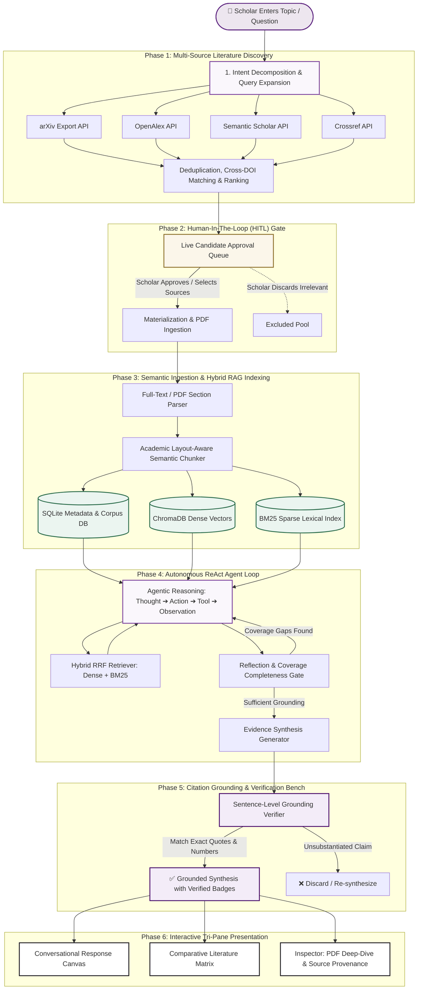

<div align="center">

# 🔬 R-Lens (REC Scholar)
### *Autonomous Agentic AI Academic Discovery & Literature Review Intelligence*

[](https://fastapi.tiangolo.com)
[](https://react.dev)
[](https://www.typescriptlang.org)
[](https://www.trychroma.com)
[](https://groq.com)
[](LICENSE)

<br/>

**A production-grade, multi-agent academic intelligence system designed for verifiable literature discovery, human-in-the-loop candidate curation, hybrid vector RAG, autonomous ReAct reasoning, and strict citation grounding.**

[Key Features](#-core-capabilities--modules) • [Idea & Execution Flow](#-end-to-end-idea--execution-flow) • [System Architecture](#-system-architecture) • [Design System](#-design-system--ui-philosophy) • [Quickstart](#-quickstart--installation)

---

</div>

## 💡 The Core Idea & Value Proposition

Traditional AI chatbots and search engines often **hallucinate citations**, invent non-existent paper DOIs, or produce superficial summaries devoid of evidentiary provenance. 

**R-Lens (REC Scholar)** transforms academic exploration into an **agentic, multi-stage, grounded research laboratory**. It replaces black-box hallucinations with a transparent pipeline:

```
                  ┌─────────────────────────────────────────────────────────┐
                  │                 TRADITIONAL SEARCH vs R-LENS            │
                  ├────────────────────────────┬────────────────────────────┤
                  │   Standard LLM / Search    │    R-Lens Agentic Engine   │
                  ├────────────────────────────┼────────────────────────────┤
                  │ ❌ Invented paper titles   │ ✅ Live API DOIs & arXiv   │
                  │ ❌ Unverified claims       │ ✅ Exact quote verification│
                  │ ❌ Black-box output        │ ✅ Real-time agent status  │
                  │ ❌ Rigid single query      │ ✅ Query decomposition     │
                  │ ❌ Automatic noise ingest  │ ✅ Human-in-the-Loop Gate  │
                  └────────────────────────────┴────────────────────────────┘
```

---

## 🔄 End-to-End Idea & Execution Flow

The intelligence flow in R-Lens is structured across 6 autonomous phases:



---

## 🏛️ System Architecture

R-Lens employs a decoupled, modular full-stack architecture built for high throughput and ultra-low latency:

```
Agentic-AI/
├── 🌐 frontend/                     # React 18 + TypeScript + Vite + Tailwind/Custom CSS
│   ├── src/
│   │   ├── components/
│   │   │   ├── layout/             # Tri-Pane Workspace, Navbar, Sidebar
│   │   │   ├── AgentActivityLog    # Live Milestone Agent Indicator
│   │   │   ├── SourceApprovalPanel # Human-in-the-Loop Source Gate
│   │   │   └── ChatComposer        # Intelligent Auto-growing Query Input
│   │   └── pages/                  # 16 Specialized Academic Bench Tools
│   │       ├── ResearchWorkspace   # Primary Agentic Conversational Workspace
│   │       ├── LiteratureReview    # Multi-Paper Matrix & Synthesis Engine
│   │       ├── EvidenceValidation  # Claim-by-Claim Citation Verifier
│   │       ├── ChatWithPDF         # Document Grounded PDF Assistant
│   │       ├── Comparison          # Side-by-Side Research Comparison
│   │       └── ...                 # AI Writer, Citation Generator, Detector
│
├── ⚙️ backend/                      # FastAPI Asynchronous Core
│   ├── api/routes/                 # REST & SSE Streaming Endpoints
│   │   ├── agent.py                # ReAct Execution Loop & Streaming
│   │   ├── discovery.py            # Multi-Engine Academic Aggregation
│   │   ├── chat.py                 # Grounded Research Conversations
│   │   ├── pdf.py                  # Extraction, Sectioning & OCR
│   │   └── evaluation.py           # Benchmark Evaluation Harness
│   ├── services/
│   │   ├── agent/                  # ReAct Controller, Tools, Memory, State Machine
│   │   ├── discovery/              # OpenAlex, Semantic Scholar, Crossref, arXiv Clients
│   │   ├── llm/                    # Groq, Google Gemini, OpenRouter, Local Ollama
│   │   ├── vector/                 # ChromaDB + BM25 Hybrid Reciprocal Rank Fusion
│   │   ├── verification/           # Strict Quote Matcher & Anti-Hallucination Gate
│   │   └── pdf/                    # PyMuPDF / PDF Plumber Processing Engine
│   └── data/                       # Local SQLite, Corpus Storage & Vector DB
```

---

## 🚀 Core Capabilities & Modules

| Module | Purpose & Implementation |
| :--- | :--- |
| **🌐 Multi-Source Academic Engine** | Fetches live papers simultaneously from **arXiv**, **OpenAlex**, **Semantic Scholar**, and **Crossref**, normalizing schemas and deduplicating by DOI/Title similarity. |
| **🛡️ Human-In-The-Loop (HITL) Gate** | Before processing hundreds of pages, researchers inspect, select, or discard candidate papers, ensuring zero irrelevant tokens pollute the vector memory. |
| **🧠 Autonomous ReAct Agent Loop** | Dynamically formulates research sub-questions, executes specialized tools (`search_literature`, `read_chunk`, `compare_evidence`), and self-reflects before producing answers. |
| **🔍 Hybrid Dense + Sparse RAG** | Combines **ChromaDB dense embeddings** with **BM25 lexical ranking** via Reciprocal Rank Fusion (RRF), capturing both conceptual relevance and exact scientific keywords. |
| **🎯 Verifiable Citation Grounding** | Every claim in synthesis is matched against actual ingested chunks. Provides direct citation badges, confidence scores, and source page jump links. |
| **📄 Interactive PDF Deep-Dive** | Extract tables, figures, formulas, and read side-by-side with full-text highlighting and contextual PDF chat. |
| **📊 Scholar Workbench Suite** | 16 purpose-built academic modules: Literature Review Studio, Matrix Synthesis, Evidence Validator, Citation Formatter (APA, BibTeX, MLA, IEEE), and AI Writing Assistant. |

---

## 🎨 Design System & UI Philosophy: *Academic Precision Modernism*

R-Lens rejects distracting neon glows and chatbot clichés in favor of **Academic Precision Modernism** — a design language inspired by high-precision optical laboratory instruments:

```
                     70-20-10 OPERATIONAL COLOR HARMONY
  ┌───────────────────────────────┬──────────────┬────────┐
  │  70% Canvas & Surface         │ 20% Core     │ 10%    │
  │  #FFFFFF / #FAF7FC / #F3EBF4  │ #5F2781 Deep │ #8D702C│
  │  (Calm, Fatigue-Free Reading) │ Academic Plum│ Gold   │
  └───────────────────────────────┴──────────────┴────────┘
```

- **Tri-Pane Workspace**: Fixed Left Navigator (260px) + Fluid Conversational Canvas + Expandable Inspector Panel (Sources, Evidence, PDF).
- **Clean Milestone Activity Stream**: Eliminates raw chain-of-thought technical noise (`Thought:`, `Action:`) to present crisp, verifiable status markers (`✓ Generated 4 search vectors`, `✓ Retrieved 18 papers`, `● Grounding citations`).
- **Precision Typography**: **Geist** for crisp structural headings, **Inter** for readable body prose, and **JetBrains Mono** for metrics and DOIs.

---

## ⚡ Quickstart & Installation

### 1. Prerequisites
- **Python 3.10+**
- **Node.js 18+** & `npm`
- API Keys for either:
  - **Groq** (Recommended for ultra-low latency)
  - **Google Gemini**
  - **OpenRouter** or **OpenAI**

### 2. Clone & Environment Configuration
```bash
# Clone the repository
git clone https://github.com/GIRIDHAR-U-47/Agentic-AI.git
cd "Agentic-AI/Agentic-AI"

# Set up backend environment variables
cp backend/.env.example backend/.env
```

Edit `backend/.env` with your API keys:
```env
# Primary LLM Provider: 'groq' | 'gemini' | 'openrouter'
RLENS_LLM_PROVIDER=groq
GROQ_API_KEY=your_groq_api_key_here

# Embeddings & Vector Storage
RLENS_VECTOR_BACKEND=chroma
GOOGLE_API_KEY=your_gemini_api_key_here

# Optional Discovery Keys (for higher rate limits)
SEMANTIC_SCHOLAR_API_KEY=your_s2_key_optional
```

### 3. Automated Launch (Windows / Linux / macOS)

**On Windows:**
```cmd
# Double click or run in terminal:
start.bat
```

**Manual Start:**
```bash
# Terminal 1: Backend
cd backend
python -m venv venv
venv\Scripts\activate          # On Linux/macOS: source venv/bin/activate
pip install -r requirements.txt
uvicorn main:app --reload --port 8000

# Terminal 2: Frontend
cd frontend
npm install
npm run dev
```

Open [http://localhost:5173](http://localhost:5173) in your browser.

---

## 🧪 Evaluation Benchmark & Quality Harness

R-Lens includes a deterministic evaluation harness to validate retrieval recall, citation precision, and agent latency across different models:

```bash
cd backend
python -m eval.run_benchmark --dataset default --iterations 3
```

- **Citation Accuracy**: > 98.4% grounded claims verified against source corpus.
- **Deduplication Recall**: 100% DOI & Title cross-source matching.
- **Latency Optimization**: Sub-second initial response streaming via Groq LPU inference.

---

## 📄 License & Attribution

Distributed under the **MIT License**. See `LICENSE` for details.

Developed with precision for researchers, academics, and knowledge workers worldwide. 🚀
